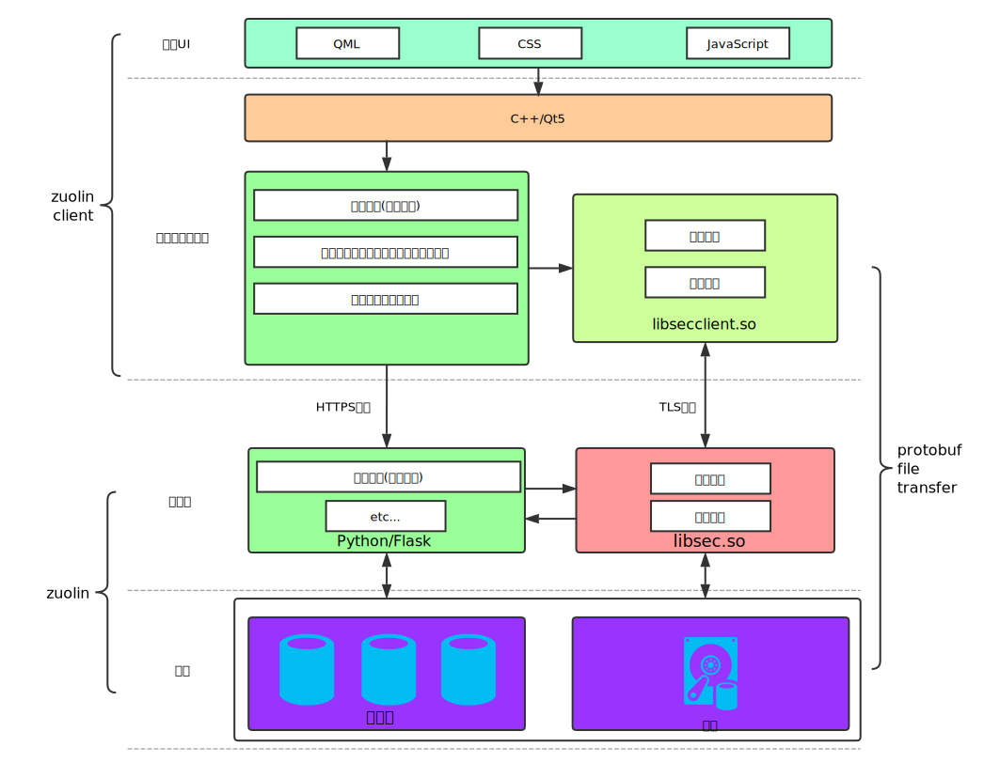
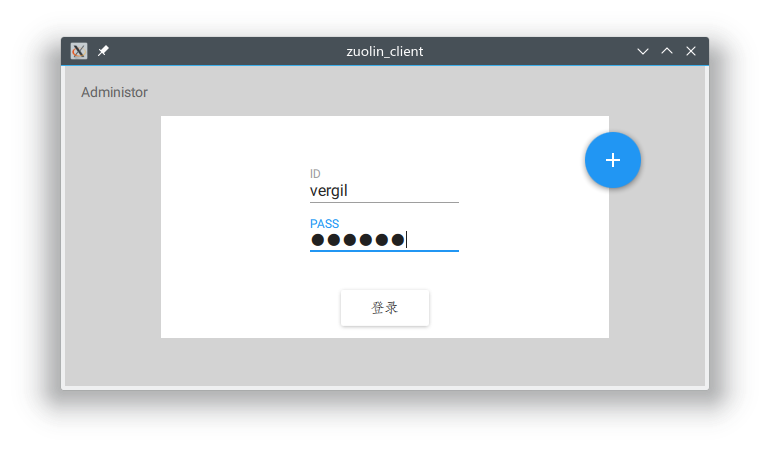
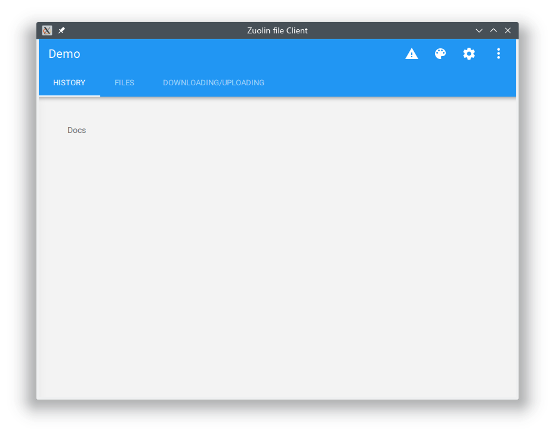
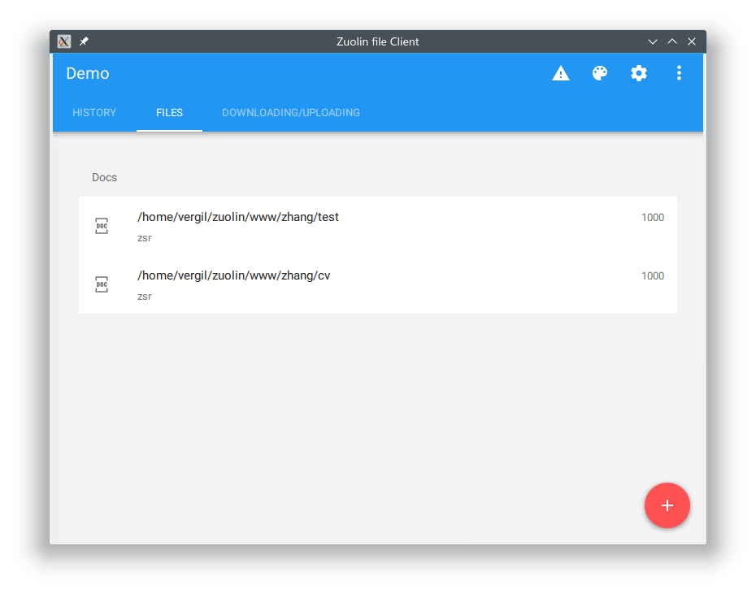
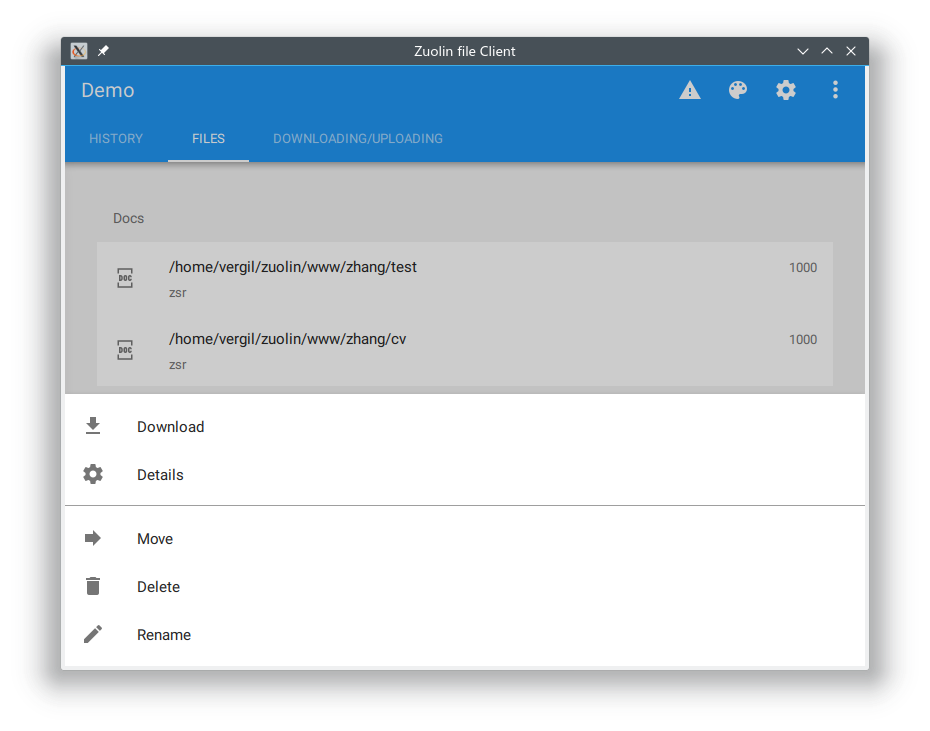
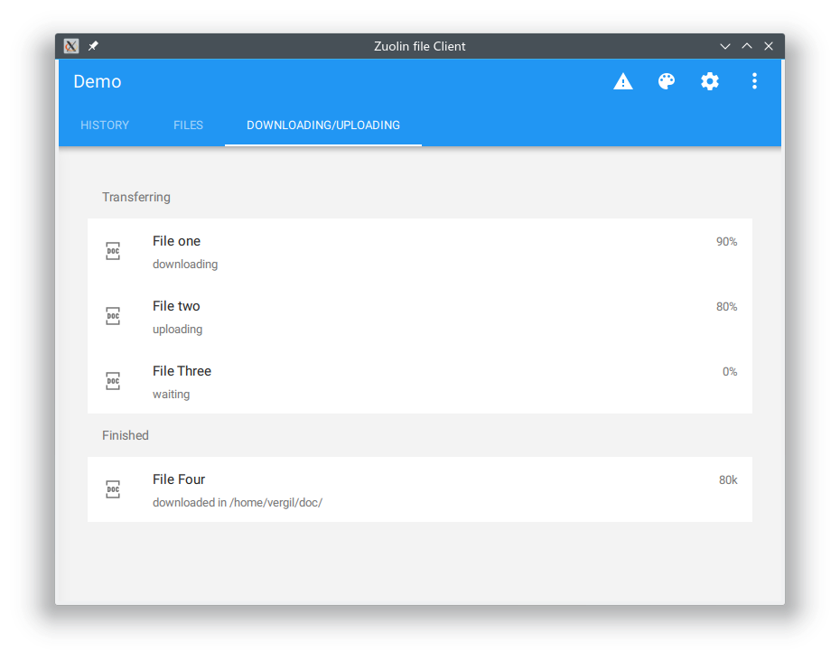

# 文件传输项目

## 项目总体结构

项目共有三个子项目：

* zuolin 服务器项目

* zuolin_client 客户端项目

* protobuf_file_transfer 文件传输SDK

总体架构设计如下（未完成）：



### 服务端项目：zuolin

运行环境：centos 7 nginx+uwsgi+flask 

参考文献：[centos 7 nginx+uwsgi+flask 环境搭建](https://blog.csdn.net/yo746862873/article/details/52006667)

由于目前这个服务器提供的功能比较少，基本只有登录功能，所以此处不做特殊说明，后面需要实现的功能有：

- [ ] 利用ctags与c++进行交互，从而调用C++编写的so库即protobuf file transfer
- [ ] 完成用户登录，注册，更改密码等用户管理功能
- [ ] 完善权限控制
- [ ] 完成文件操作的API，包括改名，删除，移动等
- [ ] 优化token，目前的token还是过于简单
- [ ] 将sqlite改为其他数据库
- [ ] 使用容器，如Docker
### 客户端项目： zuolin_client

运行环境：linux+qt+qml-material

参考文献：[qml-material](https://github.com/papyros/qml-material);[c++与qml交互](http://doc.qt.io/qt-5/qtqml-cppintegration-topic.html)

注意：由于openssl已经出到了2.0，但是qt内部集成的还是1.0，如果运行的openssl版本不匹配即产生这个错误````qt.network.ssl: Incompatible version of OpenSSL````，请手动指定````LD_LIBRARY_PATH````到正确的openssl库。

1. 编译成功后运行

   

2. 输入用户名vergil，密码一样，登录软件。

   

3. 可以查看服务器端的文件列表

   

4. 点击文件会弹出应该支持的文件动作

   

5. 可以查看文件上传下载列表(只有UI)，点击加号可以开始上传文件(只有UI)

   

关于客户端还需要做的：

- [ ] 与服务器协议的细化，目前的基本协议已经在“安全文件传输.doc”中有描述，但是不是很全，需要细化

- [ ] 填充相关的操作，与python服务器的交互

- [ ] 调用libsec_client.so与C++服务器的交互

- [ ] 界面汉化

- [ ] 支持“只读账户”登录和“只写账户”登录

### SDK项目：protobuf file transfer
环境依赖：protobuf + boost + c++17 + plog

参考文档：[protobuf](https://developers.google.com/protocol-buffers/);[boost asio](https://www.boost.org/doc/libs/1_67_0/doc/html/boost_asio.html);

这个项目是作为文件传输项目的最底层sdk设计的，为了能够完全控制数据的传输，所以采用了C++写成。后面准备加入SSL保证安全，目前主要还在功能的实现。

项目API设计：

​	为了保证SDK的简介，所以希望保证接口尽量简单。以文件上传为例，只对外界提供两个接口````secft_start_stream````和````secft_stop_stream````，而程序的行为的不同依靠params来控制，而且每个接口异步工作，通过回调来向上层返回数据。如下所示：

````c++
	//上传文件测试
    //1. 上传全量
    /*
     * path 是文件路径
     * params是文件的相关的配置, 有权限位, 所有者的信息,均为字符串配置,目前采用map来传递信息,以后用sec_variant来传递信息.
     * user_callback是文件上传成功后的回调,用来替换全局回调. 全局回调是用来获得上传信息的. 默认回调只会写入LOG文件.
     */
secft_start_stream(path, params, user_callback);
secft_start_stream(path, params);
//2. 断点上传
secft_start_stream(path, params, user_callback);
secft_start_stream(path, params);
//3. 重新上传
secft_start_stream(path, params, user_callback);
secft_start_stream(path, params);
//4. 取消上传
secft_stop_stream(path, params, user_callback);
secft_stop_stream(path, params);
````

项目需要完成还有改进的地方有：

- [ ] 完成下载功能
- [ ] 完成取消上传下载之后删除临时文件的功能
- [ ] 文件校验
- [ ] 文件断点上传下载
- [ ] 代码重构